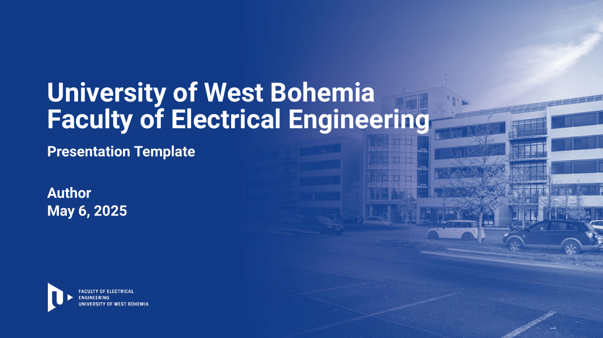

  
  
  
  
  
  

This is the official Latex presentation template for the [Faculty of Electrical Engineering](https://www.fel.zcu.cz/en/) of the University of West Bohemia.

# Download

There are two possibilities of using this template:

- Download this repo and modify the `main.tex` file.
- Open the project on [Overleaf](https://www.overleaf.com/read/mqszxcxvgjcj#620afc) and [create a copy](https://www.overleaf.com/learn/how-to/Copying_a_project) of it (click `Menu -> Create a copy` when logged in).

# Latex parameters

There are three parameters in the `main.tex` file:

- cslang (default off): Shows the presentation in English. When uncommented, it changes the language to Czech.
- ricemode (default off): Shows the images of the Faculty of Electrical Enginnering. When uncommented, it changes the image of [RICE](https://www.rice.zcu.cz/en/).
- nologo (default off): Shows the logo at the bottom left corner. When uncommented, it removes it.